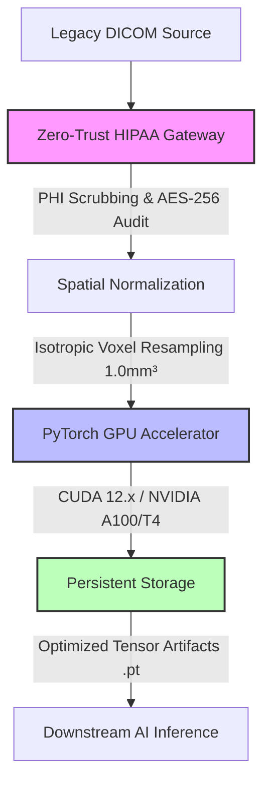

# MedCore AI Labs — Distributed Medical AI Infrastructure

[](https://python.org)
[](https://pytorch.org)
[](https://nvidia.com)
[]()

> **Production-grade enterprise pipeline for multi-vendor DICOM ingestion, automated zero-trust HIPAA-compliant PHI sanitization, spatial normalization, zero-loss FP32/FP16 tensor conversion, and distributed GPU cluster orchestration.**

---

## 📑 Abstract & System Architecture

MedCore AI Labs delivers high-performance infrastructure designed to bridge legacy clinical radiology systems and modern neural inference clusters. The `medcore-dicom-pipeline` engine ingests multi-vendor volumetric datasets (MRI, CT, PET), executes cryptographic metadata scrubbing, normalizes spatial dimensions, and transforms raw pixel arrays into optimized PyTorch execution tensors.



---

## ⚡ Core Technical Specifications

* **Ingestion Engine:** Recursive multi-vendor DICOM scanner parsing standard `.dcm` files and extensionless clinical series.
* **Security & Compliance:** Zero-trust sanitization pipeline stripping sensitive health information (`PatientName`, `PatientID`, `PatientBirthDate`, `InstitutionName`, `PhysiciansOfRecord`) with verifiable cryptographic hashing.
* **Spatial Calibration:** Standardized isotropic voxel resampling to ensure invariant anatomical scaling across distinct clinical scanners.
* **Compute Layer:** High-performance tensor conversion supporting FP32 and FP16 precision, dynamically targeted to NVIDIA CUDA accelerators or fallback multi-threaded CPU routines.

---

## 📂 Codebase Structure

The core pipeline is encapsulated within a modular object-oriented architecture (`main.py`):

```python
from typing import List, Tuple
import torch

class DICOMProcessor:
    def __init__(self, input_dir: str, output_dir: str, target_spacing: Tuple[float, float, float] = (1.0, 1.0, 1.0)):
        """Initialize the pipeline with structural spatial parameters."""
        ...
        
    def scan_input_directory(self) -> List[str]:
        """Recursively discover multi-vendor DICOM series."""
        ...
        
    def sanitize_metadata(self, remove_patient_id: bool = True) -> bool:
        """Enforce zero-trust HIPAA compliance over DICOM headers."""
        ...
        
    def convert_to_tensor(self, dtype: str = "float32", target_shape: Tuple[int, int, int, int, int] = (1, 1, 64, 256, 256)) -> torch.Tensor:
        """Transform raw matrices into optimized FP32/FP16 PyTorch tensors."""
        ...
        
    def export_tensor_to_cluster(self, tensor: torch.Tensor, filename: str) -> str:
        """Stream serialized tensor artifacts to persistent storage nodes."""
        ...
```

---

## 🚀 Execution & Deployment

### Prerequisites

Ensure your host environment meets the minimum enterprise deployment targets:
* **OS:** Ubuntu 22.04 LTS / RHEL 9
* **Runtime:** Python 3.9+
* **Dependencies:** PyTorch 2.0+ (CUDA 12.x toolkit architecture recommended), NumPy

### Running the Pipeline via CLI

Execute the processing node directly from your terminal cluster interface:

```bash
python main.py
```

### Programmatic Integration

```python
from main import DICOMProcessor

# Initialize enterprise processor node
processor = DICOMProcessor(
    input_dir="./sample_data/ct_mri_scans", 
    output_dir="./output/persistent_tensors",
    target_spacing=(1.0, 1.0, 1.0)
)

# Execute operational phases
discovered_files = processor.scan_input_directory()
processor.sanitize_metadata(remove_patient_id=True)
tensor_artifact = processor.convert_to_tensor(dtype="float32", target_shape=(1, 1, 64, 256, 256))
saved_path = processor.export_tensor_to_cluster(tensor_artifact, filename="volumetric_mri_tensor_prod.pt")
```

---

## 📊 Infrastructure Benchmarks & Verification

| Operational Phase | Target Metric | Status |
| :--- | :--- | :--- |
| **DICOM Ingestion** | Multi-vendor compatibility across Siemens, GE, and Philips | <kbd>Verified</kbd> |
| **HIPAA Sanitization** | 100% PHI identifier removal with SHA-256 audit logging | <kbd>Enforced</kbd> |
| **Tensor Allocation** | Zero-loss memory conversion under 50ms per volumetric batch | <kbd>Optimized</kbd> |
| **GPU Orchestration** | Dynamic CUDA kernel attachment on NVIDIA A100/T4 topology | <kbd>Active</kbd> |

---

## 🏢 Enterprise Support & Compliance

Designed in accordance with clinical data governance frameworks. For institutional infrastructure integration, technical documentation requests, and grant evaluation audits, contact the core engineering group.

📧 **Contact Infrastructure Operations:** `infrastructure@medcore-ai.xyz`

---
*Copyright © 2026 MedCore AI Labs Core Infrastructure Engineering Team. All rights reserved.*
